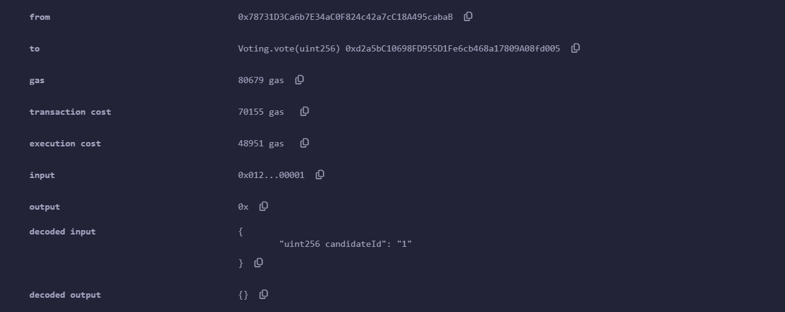
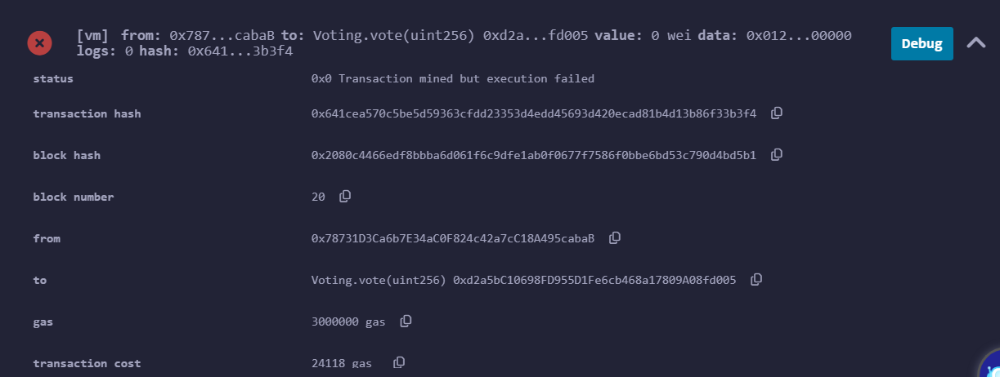
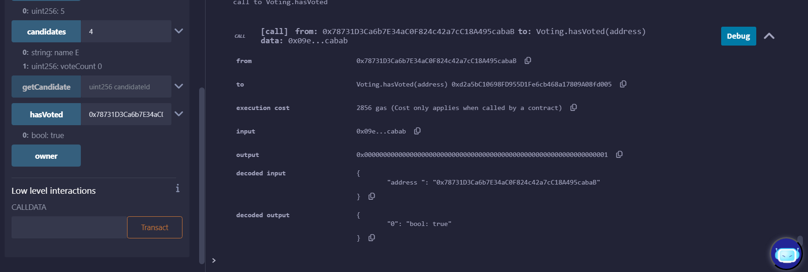

# Thêm 5 candidate A, B, C, D, E bằng owner: 0x5B38Da6a701c568545dCfcB03FcB875f56beddC4

# Vote A, B bằng: 0x78731D3Ca6b7E34aC0F824c42a7cC18A495cabaB

### Vote B

### Vote A lỗi (vì vote rồi)

### Kiểm tra addr đã vote chưa

